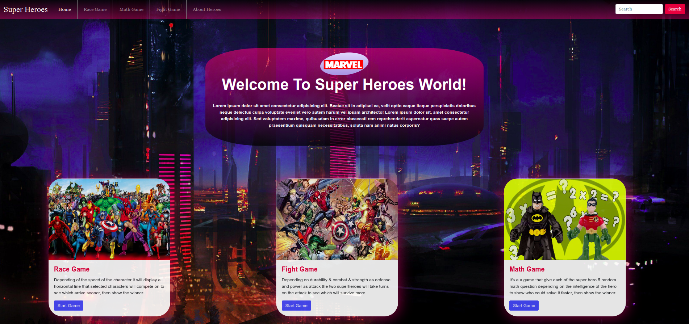
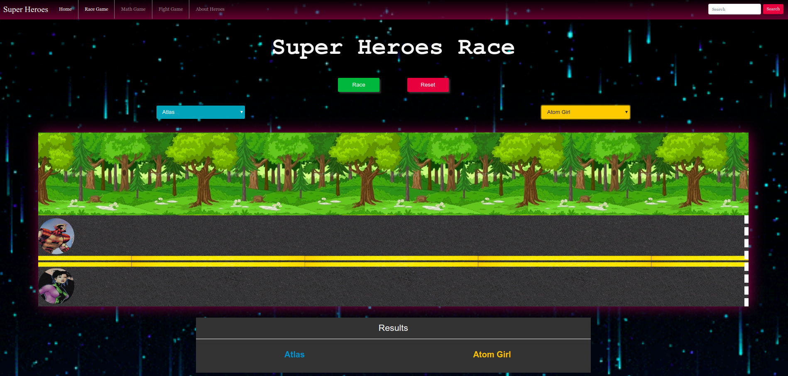
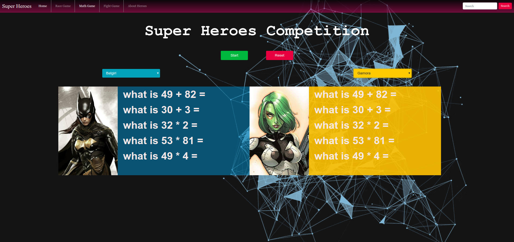
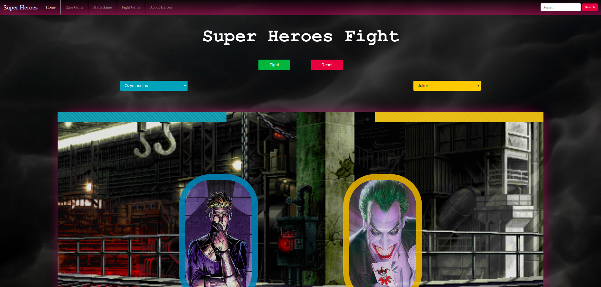
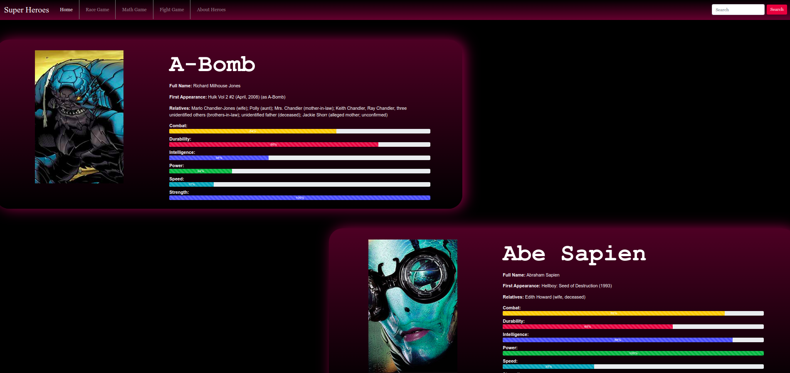

# Welcome To Super Heroes Game App!



This app use [Super Heroes API](https://akabab.github.io/superhero-api/api/all.json), and contain three games: race game, math game, and fight game, there is also a page that contain informations about heroes.

#### Race Game:

Depending of the speed of the character it will display a horizontal line that selected characters will compete on to see which arrive sooner, then show the winner.


#### Math Game:

It's a a game that give each of the super hero 5 random math question depending on the intelligence of the hero to show who could solve it faster, then show the winner.


#### Fight Game:

Depending on durability & combat & strength as defense and power as attack the two superheroes will take turns on the attack to see which will survive more.


#### About Heroes:

This page display each superhero with its information like : super hero name, real name, first appearance, power stats …etc.


## SuperHeroProject

This project was generated with [Angular CLI](https://github.com/angular/angular-cli) version 7.3.8.

## Development

### Installing Dependencies

From within the root directory:

```sh
npm install
```

### Run App

From within the root directory:

```sh
ng serve --open
```

OR

```sh
npm start
```

Navigate to `http://localhost:4200/`. The app will automatically reload if you change any of the source files.
